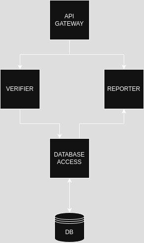

# Work Schedule Verifier

## Project description
This project is designed to showcase my skills in developing REST APIs. Below you'll find a brief overview of the task requirements and instructions.

## Project Overview

The goal of this project is to create a REST API that provides two main services:

1. **Checking the 11-hour rest rule for a submitted schedule**: This service will verify if the submitted work schedule complies with the 11-hour rest rule.
2. **Returning a list of recent schedule verifications along with a list of errors**: This service will provide a history of recent schedule verifications and any associated errors.

## Requirements

- Docker
- docker-compose

## Getting Started 
To get started with the project, follow these steps:
1. Clone the repository:
   ```bash 
    git clone git@github.com:Osirys25/work-schedule-verifier.git 
   ```
2. Navigate to the project directory:
    ```bash 
    cd work-schedule-verifier
   ```

## Running the Project
To run the project for development, use the following commands:
1. Install required dependencies:
    ```bash
   (cd verifier && npm install) && (cd reporter && npm install) && (cd database-access && npm install) && exit
    ```
2. Run docker compose:
    ```bash 
    docker compose up
   ```
---
To run the project for production, you can use `docker-compose-prod.yml`. Please, use following command:
```bash
    docker compose -f docker-compose-prod.yml up
```
---
   You could use running system via `localhost` network with address:
   ```
   http://localhost
   ```
---
### Testing the project
To verify and test the project you can use prepared **Postman** collection.\
It has been placed in `/tests/api` directory.\
File named: `work-schedule-verifier.postman_collection.json`.\
You can import it directly to **Postman**.

## Architecture overview
Below, you can see an image of the complete system architecture diagram.


- **API Gateway**
    - Utilizes **NGINX** and serves as both an API gateway and a load balancer.

- **Verifier**
    - A service written in **Node.js** that verifies submitted work schedules, send required data to the `database-access` service.

- **Reporter**
    - A service written in **Node.js** that retrieves data from the `database-access` service, processes the data, and sends it to the user.

- **Database-Access**
    - A service written in **Node.js** that handles database access and processes incoming data queries.

- **DB (Database)**
    - A relational database using **PostgreSQL**.

----
# API Documentation
## Employee Shift Validation Endpoint
### Endpoint: /verifier/check/
This endpoint validates the provided employee shifts and returns any errors found.

## Request

**Method:** `POST`  
**URL:** `/api/v1/verifier/check/`  
**Content-Type:** `application/json`

### Request Body

The request body should be a JSON object containing two properties: `employees` and `employeeShifts`.

#### employees

An array of employee objects. Each employee object should have the following properties:

- `id`: A unique identifier for the employee (string).
- `first_name`: The first name of the employee (string).
- `last_name`: The last name of the employee (string).
- `flexible_hours`: Indicates if the employee has flexible working hours (boolean).

#### employeeShifts

An array of employee shift objects. Each shift object should have the following properties:

- `employee_id`: The unique identifier of the employee (string).
- `start_time`: The start time of the shift (string, ISO 8601 format).
- `end_time`: The end time of the shift (string, ISO 8601 format).

Example body:
```json
{
   "employees": [
      {
         "id": "123",
         "first_name": "Jan",
         "last_name": "Kowalski",
         "flexible_hours": false
      },
      {
         "id": "124",
         "first_name": "Anna",
         "last_name": "Nowak",
         "flexible_hours": true
      }
   ],
   "employeeShifts": [
      {
         "employee_id": "123",
         "start_time": "2025-04-23T08:00:00Z",
         "end_time": "2025-04-23T16:00:00Z"
      },
      {
         "employee_id": "123",
         "start_time": "2025-04-24T06:00:00Z",
         "end_time": "2025-04-24T14:00:00Z"
      },
      {
         "employee_id": "124",
         "start_time": "2025-04-23T10:00:00Z",
         "end_time": "2025-04-23T18:00:00Z"
      }
   ]
}
```

### Responses

#### 200 OK

The request was successful, and the response contains the validation result.

Example response:

```json
{
  "is_schedule_valid": false,
  "violations": [
    {
      "employee_name": "Tomasz Lewandowski",
      "date": "2025-04-24",
      "details": "The break between shifts was only 9.00 hours."
    },
    {
      "employee_name": "Katarzyna Szymańska",
      "date": "2025-04-24",
      "details": "The break between shifts was only 8.00 hours."
    }
  ]
}
```
----
## Verifications history endpoint
### Endpoint: `/reporter/history/`
This endpoint retrieves verification details with pagination.

#### Request
- **Method**: `GET`
- **URL**: `/api/v1/reporter/history/`
- **Content-Type**: `application/json`
- **Authentication**: Basic Authentication required

#### Parameters

- **limit** (query parameter, required): The number of records to return.
- **offset** (query parameter, required): The number of records to skip.

#### Example request
```http
GET /api/v1/reporter/history/?limit=10&offset=0 HTTP/1.1
Host: localhost
Authorization: Basic YWRtaW46YWRtaW4=
```

#### Authentication Details
To access this endpoint, you need to provide Basic Authentication credentials. The Authorization header should be included in the request, formatted as follows:
```
Authorization: Basic <base64_encoded_credentials>
```
Where <base64_encoded_credentials> is the base64 encoding of username:password. For example, for the username `admin` and password `admin`, the header would be:
```
Authorization: Basic YWRtaW46YWRtaW4=
```


#### Responses

- **200 OK**

  A list of verification details.

  ```json
  [
    {
      "uuid": "70d26182-d053-4318-869d-0e18748e3963",
      "is_valid": false,
      "schedule_sha": "wTNYVs+QYZw5bK/V43zKSOVVjhUs0ReyXBY/IAMyTgY=",
      "createdAt": "2025-04-24T06:12:47.170Z",
      "updatedAt": "2025-04-24T06:12:47.170Z",
      "violations": [
        {
          "employee_name": "Tomasz Lewandowski",
          "date": "2025-04-24",
          "details": "The break between shifts was only 9.00 hours."
        },
        {
          "employee_name": "Katarzyna Szymańska",
          "date": "2025-04-24",
          "details": "The break between shifts was only 8.00 hours."
        }
      ]
    }
  ]
  ```

- **400 Bad request**

  Missing or empty required parameters.

  ```json 
   {
      "error": "Bad Request: Missing or empty required parameters"
   }
  ```
